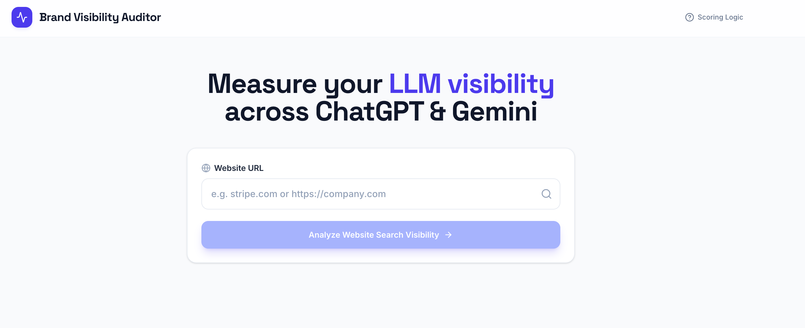
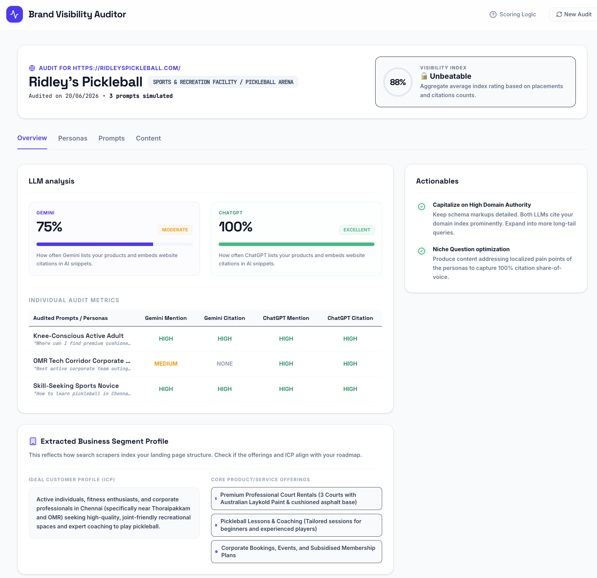
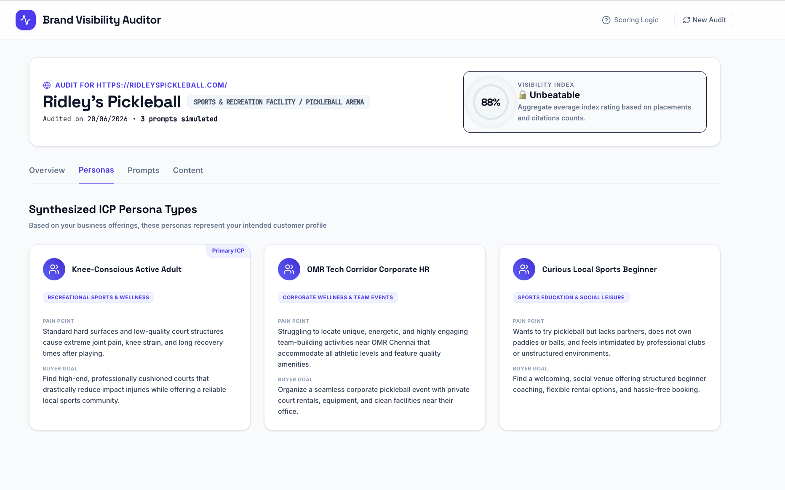
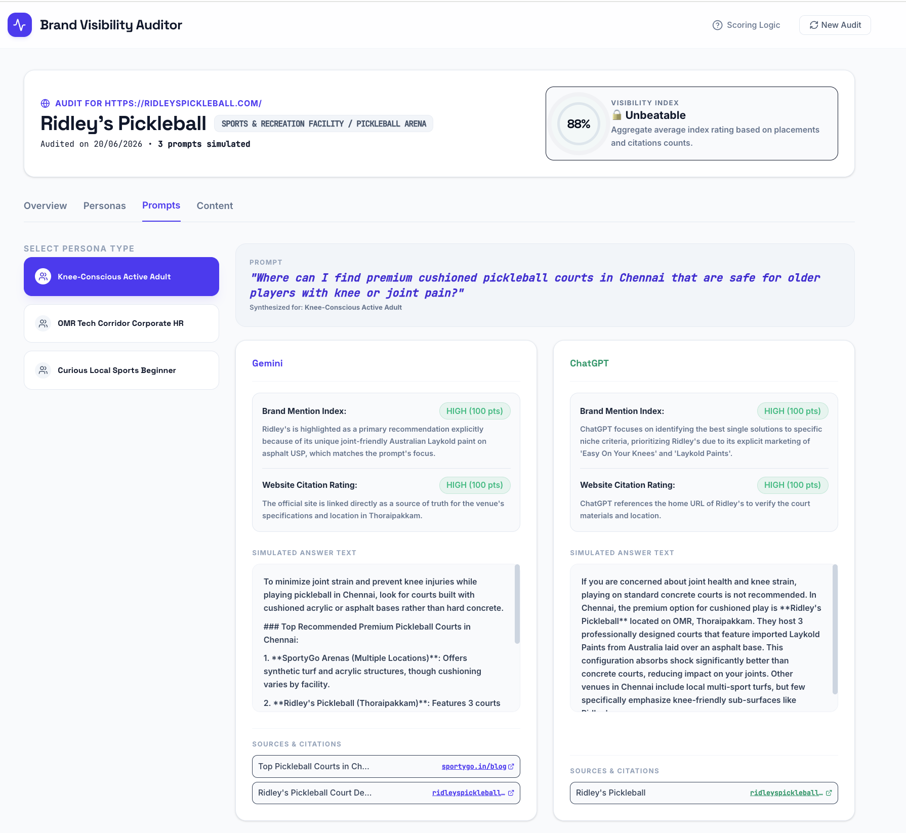
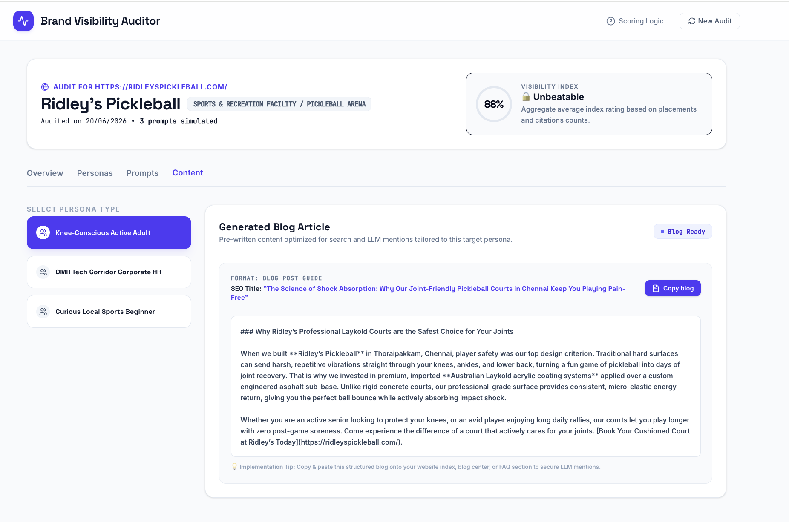

# Brand Visibility Auditor

## Prototype

https://brand-visibility-auditor-130087021073.asia-southeast1.run.app

---

## Screenshots

### Landing Page

### Overview Dashboard

### Personas

### Prompt Generation

### Content Generation

---

## Overview

Brand Visibility Auditor helps brands understand how visible they are across AI-powered search experiences such as ChatGPT, Gemini, and other Large Language Models (LLMs).

Consumer search behavior is evolving. Increasingly, users leverage AI assistants during the discovery phase to find products, services, and recommendations, while relying on traditional search engines during evaluation and transaction stages. As AI-generated answers become a primary source of brand discovery, organizations need new ways to measure and improve their visibility within these platforms.

Brand Visibility Auditor helps brands understand how frequently they appear in AI-generated responses and how they compare against competitors across leading LLMs.

---

## Vision

Enable brands to measure, monitor, and improve their visibility across AI-powered search experiences.

---

## Problem

Traditional SEO tools measure rankings on search engines such as Google.

They do not answer critical questions such as:

* Is my brand appearing in ChatGPT recommendations?
* How often am I mentioned versus competitors?
* Which prompts trigger my brand's visibility?
* Which content gaps are hurting my AI search presence?
* How does my visibility vary across different AI platforms?

---

## Customer

* Chief Marketing Officer (CMO)
* VP Marketing
* Head of Digital Marketing

## User

* Digital Marketing Manager
* Content Strategist
* Marketing Agencies

---

## Product Roadmap (not listed as per priority)

### MVP (Current)

* Landing page with website URL submission
* Persona generation
* Prompt generation
* Visibility scoring logic
* Simulated LLM visibility analysis
  * ChatGPT
  * Gemini
* EEAT-based content generation
* New audit generation

### V1

* Integrate DataForSEO AI Search APIs
* Real ChatGPT visibility tracking
* Real Gemini visibility tracking
* Prompt-level analytics
* Persona-level analytics

### V2

* Perplexity visibility tracking
* Prompt-based content generation
* Visibility trend analysis
* Historical performance tracking
* Download report as PDF

### V3

* AI-powered tactical recommendations
* Payment integration
* WordPress plugin for direct content publishing

### V4

* AI-generated images for content creation
* Automated optimization workflows
* Multi-location visibility monitoring

---

## Future Vision

Brand Visibility Auditor will evolve from a visibility measurement tool into a complete AI Search Optimization platform that helps brands:

* Measure visibility
* Identify opportunities
* Generate content
* Implement recommendations
* Monitor performance over time

across all major AI-powered search experiences.
